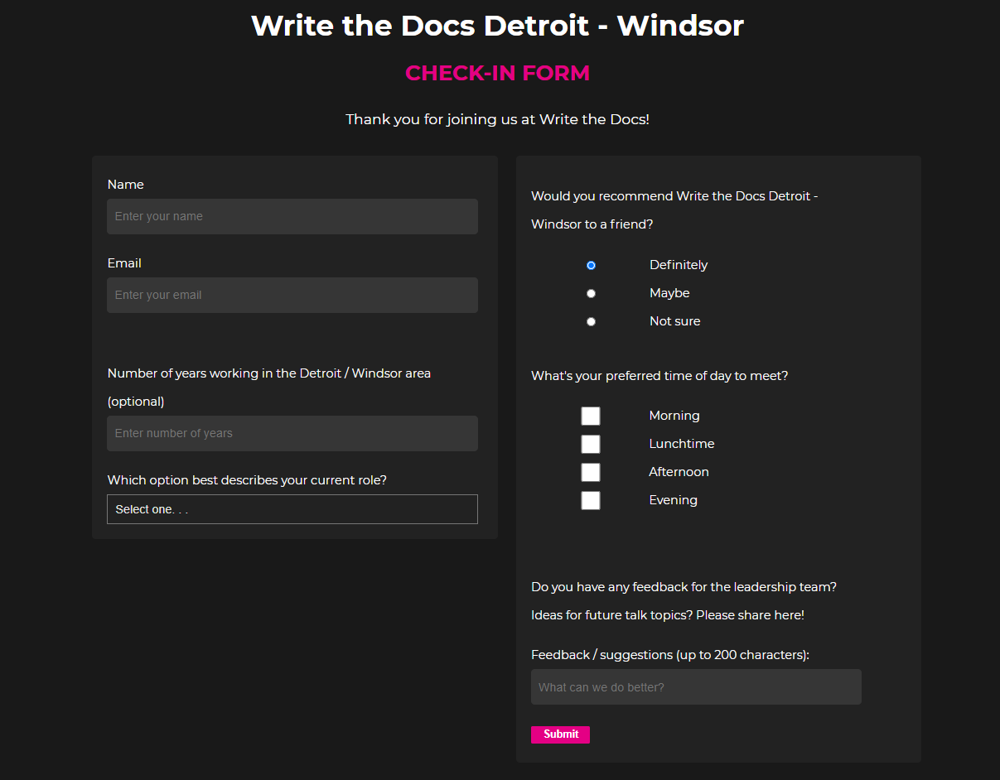

# fcc-survey-form
Welcome to my FreeCodeCamp survey form project!

A basic survey form based on FreeCodeCamp's Survey form challenge.

## See the site live

You can see the site live on [Codepen](https://codepen.io/NewWebAsh/pen/GRqdweX).

## See the project description

This site is based on a coding challenge on FreeCodeCamp. See the full
[challenge description here](https://www.freecodecamp.org/learn/responsive-web-design/responsive-web-design-projects/build-a-survey-form).

## How to contribute

I'm not currently licensed to accept code contributions. However, if you have
any feedback or suggestions, please tweet me [@NewtonLanguages](https://twitter.com/NewtonLanguages).
